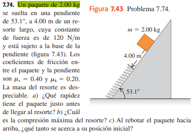

# Titulo

- [Titulo](#titulo)
  - [Subtitulo](#subtitulo)
    - [Subsubtitulo](#subsubtitulo)
  
## Subtitulo
*Texto en cursiva* **Texto en negrilla**

***Texto en cursiva y en negrilla***

### Subsubtitulo

>Tomado de markdown

```abap
DATA: te_empleados TYPE TABLE OF zhrtt_empleados. 
```

[click aqui](http://github.com)

)

| Columna A | Columna B | Columna C |
|-----------|-----------|-----------|
| 1         | 2         | 3         |
| 4         | 5         | 6         |